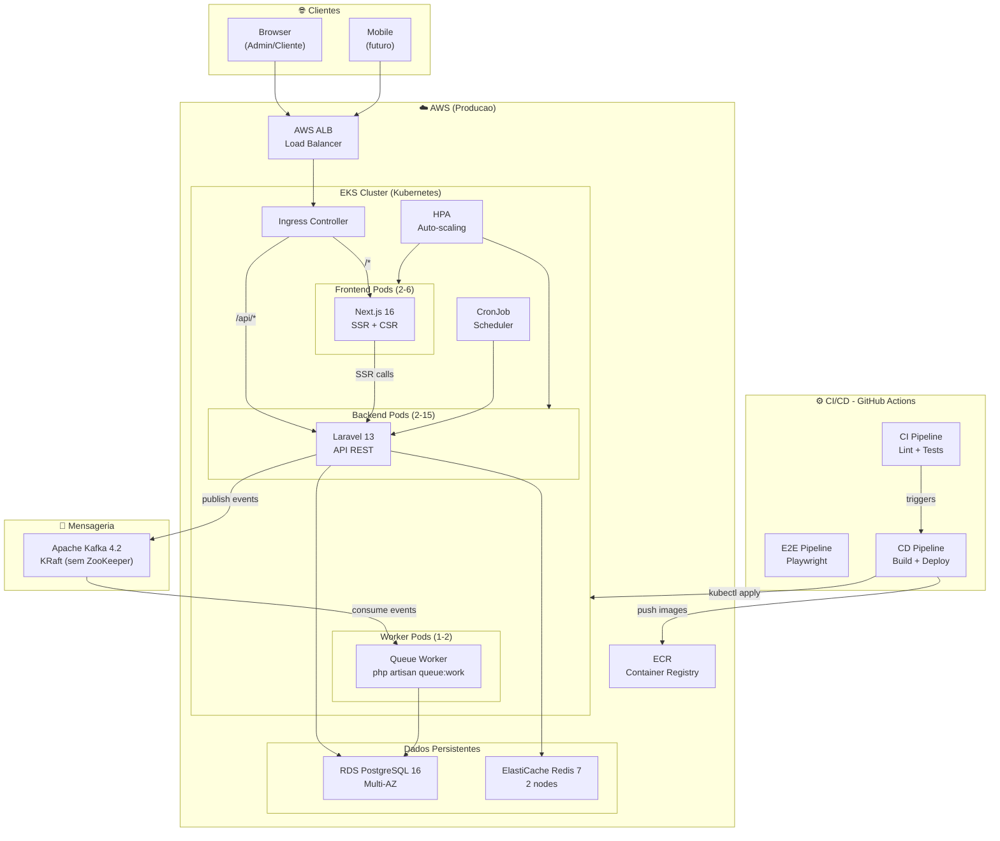
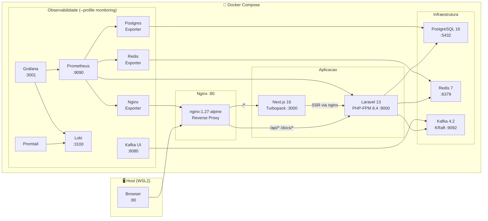
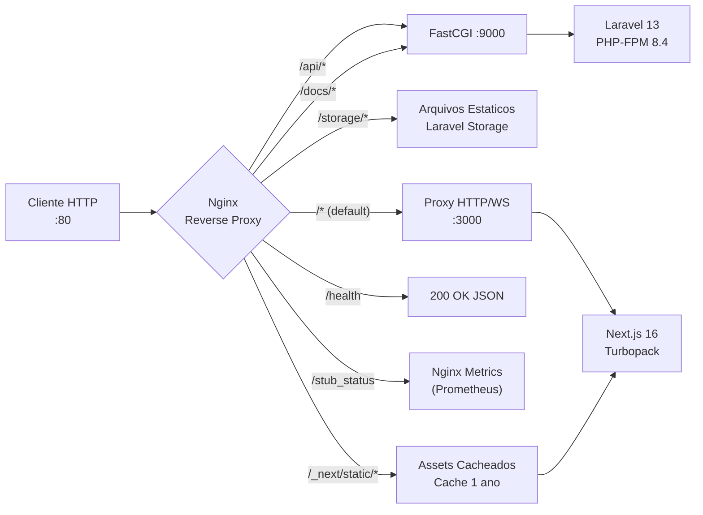
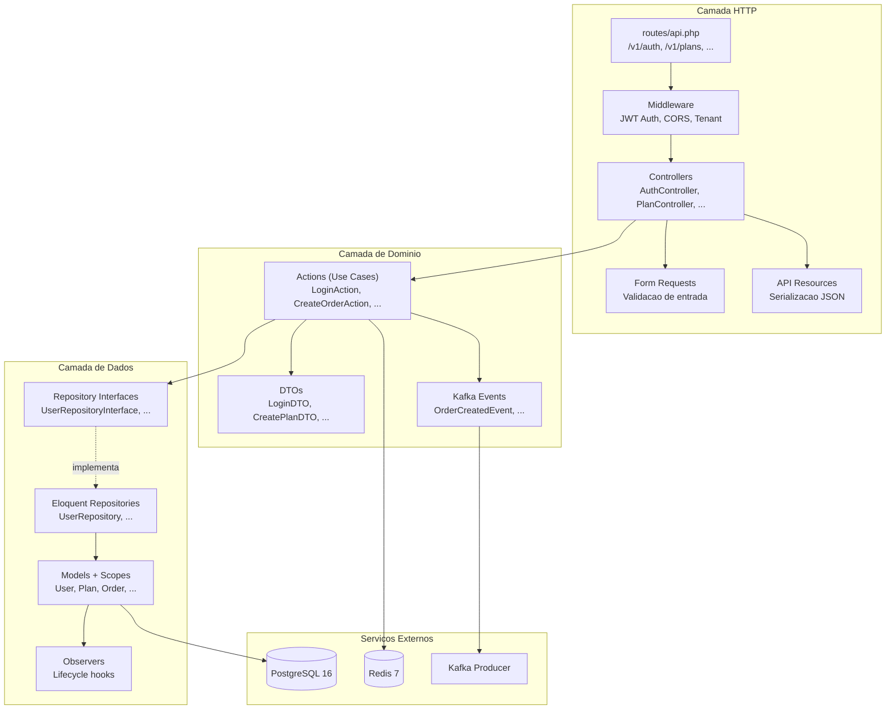
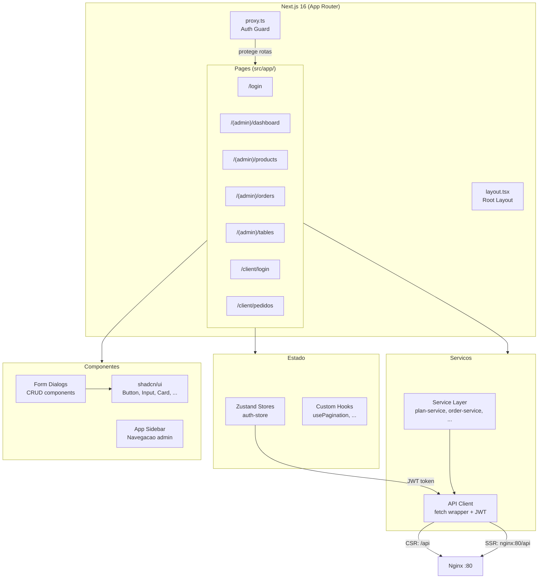
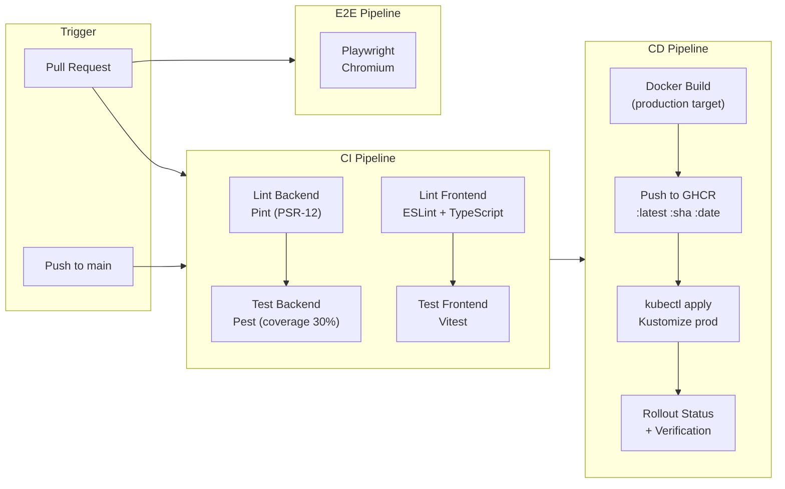
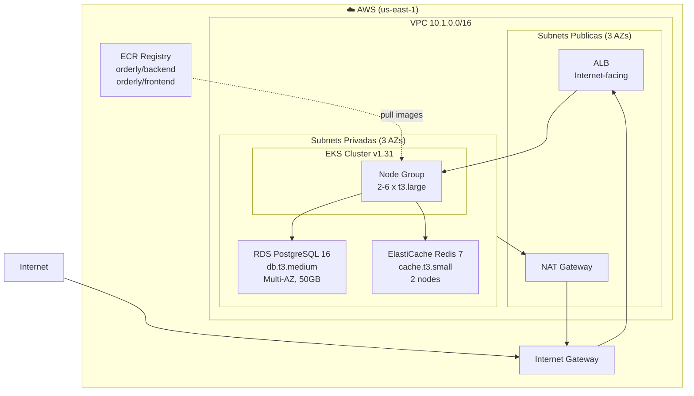
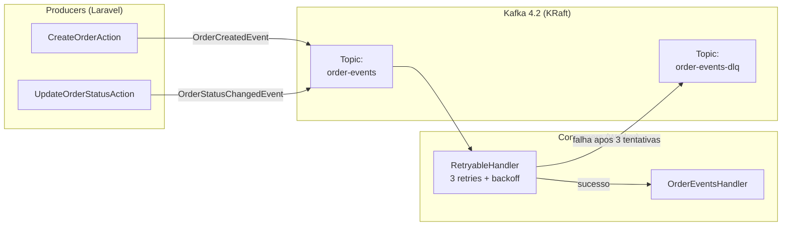

# Arquitetura Orderly - Visao Completa

## 1. Arquitetura Geral (Visao Macro)

## 2. Ambiente Local (Docker Compose)

## 3. Fluxo de Request (Nginx Routing)

## 4. Arquitetura Backend (Clean Architecture)

## 5. Arquitetura Frontend (Next.js 16)

## 6. Pipeline CI/CD

## 7. Infraestrutura AWS (Terraform)

## 8. Mensageria Kafka

## Stack Completa

| Camada | Tecnologia | Versao |
|--------|-----------|--------|
| Frontend | Next.js + TypeScript | 16.x |
| UI | shadcn/ui + Tailwind CSS | latest |
| Backend | Laravel (API-only) | 13.x |
| Banco | PostgreSQL | 16 |
| Cache/Queue | Redis | 7 |
| Mensageria | Apache Kafka (KRaft) | 4.2 |
| Auth | JWT (tymon/jwt-auth) | latest |
| Containers | Docker + Docker Compose | latest |
| Orquestracao | Kubernetes + Kustomize | latest |
| IaC | Terraform | latest |
| CI/CD | GitHub Actions | - |
| Testes BE | Pest (PHPUnit) | 4.x |
| Testes FE | Vitest + Testing Library | latest |
| Testes E2E | Playwright | latest |
| Observabilidade | Prometheus + Grafana + Loki | latest |
| API Docs | Scramble (OpenAPI/Swagger) | 0.13.x |
